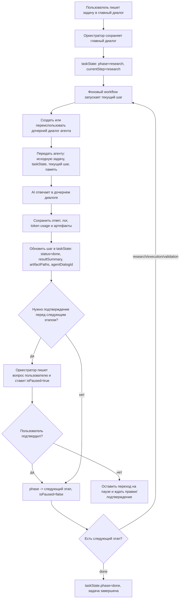

# Chat Template

Минимальный шаблон веб-чата для задач курса. Он ходит напрямую в OpenAI-compatible API выбранного провайдера.

## Запуск

1. Установи зависимости:

   ```bash
   npm install
   ```

2. Создай локальный env-файл:

   ```bash
   cp .env.example .env.local
   ```

3. Вставь ключ в `.env.local`:

   ```env
   VITE_AI_PROVIDER=deepseek
   VITE_DEEPSEEK_API_KEY=...
   ```

   Для OpenRouter можно выбрать провайдера по умолчанию и указать его ключ:

   ```env
   VITE_AI_PROVIDER=openrouter
   VITE_OPENROUTER_API_KEY=...
   ```

4. Запусти приложение:

   ```bash
   npm run dev
   ```

## Важно про ключ

`.env.local` игнорируется Git, поэтому ключ не попадет в репозиторий. Но так как приложение ходит в API напрямую из браузера, ключ технически доступен пользователю открытой страницы в собранном JS. Для учебного локального шаблона это удобно, но для публичного продакшена лучше вынести запросы к AI API на свой backend/proxy.

Если браузер покажет `Failed to fetch`, возможная причина - CORS-ограничение API-провайдера. Тогда понадобится маленький backend/proxy, даже если весь остальной интерфейс останется таким же.

## Настройки

В интерфейсе можно менять:

- провайдера (`provider`);
- ключ API (`api_key`);
- адрес API (`base_url`);
- модель (`model`) через список из API провайдера;
- системный промпт (`messages[0]`);
- креативность (`temperature`);
- ядро вероятностей (`top_p`);
- максимум токенов (`max_tokens`);
- формат ответа (`response_format.type`);
- стоп-последовательности (`stop`);
- режим размышления (`thinking.type`);
- глубину размышления (`thinking.reasoning_effort`).

Провайдер выбирается из правой панели: нажми на текущего провайдера, затем выбери DeepSeek или OpenRouter в диалоге. При переключении подставляются `api_key`, `base_url` и `model` из env-переменных выбранного провайдера.

Модель выбирается из правой панели: нажми на текущую модель, затем выбери вариант в диалоге. Шаблон загружает модели из endpoint `/models` активного провайдера и показывает локальный fallback, если API недоступен или вернул ошибку. В диалоге есть фильтры по количеству параметров и стоимости за 1M токенов. Для моделей, где API не возвращает количество параметров, значение определяется из названия/описания, если там есть формат вроде `7B`, `70B` или `1.6T`.

Текущий диалог хранится в памяти вкладки и очищается кнопкой `Очистить`. При первом сообщении нового диалога шаблон сразу просит выбрать рабочую директорию, если она еще не подключена, создает внутри нее папку `dialogs` и сохраняет текущую переписку отдельным `.json` файлом с названием сессии и коротким id, например `мой-диалог-1a2b3c4d.json`. Кнопка `Сохранить` остается для ручного сохранения и переименования диалога.

Файл диалога содержит:

- `id`, `title`, `fileName`, `createdAt`, `updatedAt`;
- `metadata` с настройками AI без API key и суммарным расходом токенов;
- `messages`, где у каждого сообщения есть `createdAt`, а после успешного API-ответа сохраняется `tokenUsage`.

Рядом с файлом диалога пишется JSONL-лог запросов и ответов. Для `мой-диалог-1a2b3c4d.json` это будет `мой-диалог-1a2b3c4d.logs.jsonl`. Каждая строка содержит один exchange: время, провайдера, модель, request body и response content/usage/error. API key и HTTP headers в лог не записываются.

Если открыть уже сохраненный диалог и продолжить переписку, файл обновится автоматически после нового ответа AI. Сохраненную историю можно открыть из боковой панели или удалить вместе с файлами кнопкой очистки истории.

## Память ассистента

В шаблоне есть четыре типа памяти и персонализации, и они хранятся отдельно:

- краткосрочная память - текущая переписка в файле диалога `*.json`;
- профиль пользователя - файл `user-profile.json`;
- память проекта - файл `project-memory.json`;
- долговременная память - файл `long-term-memory.json`.

Файлы памяти лежат в той же папке `dialogs`, что и диалоги:

```text
dialogs/
  long-term-memory.json
  project-memory.json
  user-profile.json
  мой-диалог-1a2b3c4d.json
  мой-диалог-1a2b3c4d.logs.jsonl
```

Профиль пользователя, память проекта и долговременная память редактируются вручную из правой панели кнопками `Профиль пользователя`, `Память проекта` и `Долговременная память`. Сохранение каждой кнопки пишет только свой файл. Если файла еще нет, пустая память считается нормальным состоянием.

Профиль пользователя хранит стабильные настройки персонализации: обращение, контекст пользователя, предпочтения по стилю, формату и ограничениям. Долговременная память остается свободным местом для фактов, решений и наблюдений, а память проекта - для контекста текущей задачи.

При отправке нового запроса шаблон собирает итоговый системный промпт так:

1. системный промпт из настроек;
2. блок `Профиль пользователя`;
3. блок `Долговременная память`;
4. блок `Память проекта`.

Краткосрочная память не подмешивается в системный промпт. Она отправляется как обычная история сообщений текущего диалога, так же как в OpenAI-compatible `messages`.

В шапке текущего диалога рядом с метаданными отображаются суммарные токены и примерная стоимость всего диалога. У отдельных сообщений отображается расход последнего успешного API-обмена:

- рядом с сообщением пользователя - токены запроса (`prompt_tokens`) и их примерная стоимость;
- рядом с ответом AI - токены ответа (`completion_tokens`) и их примерная стоимость.

Стоимость считается по цене выбранной модели за 1M input/output токенов. Если провайдер или fallback-каталог не знают цену модели, интерфейс показывает, что стоимость неизвестна. Суммарные токены и статистика сообщений сохраняются вместе с сохраненным диалогом.

Ответы AI отображаются как Markdown: поддерживаются заголовки, списки, ссылки, inline code и code blocks. Сообщения пользователя остаются обычным текстом.

## Оркестратор и субагенты

В этой версии шаблон работает не только как обычный чат, но и как простой агентный workflow. Главный диалог играет роль оркестратора: он хранит состояние всей задачи, двигает ее по фиксированному pipeline и создает отдельные дочерние диалоги для этапов. Дочерний диалог называется субагентом или агентом шага. Он получает только один назначенный этап, выполняет его и возвращает отчет в родительский диалог.

Pipeline фиксированный:

```text
research -> execution -> validation -> done
```

Для каждого этапа создается отдельный шаг:

- `Research: изучить задачу и контекст`;
- `Execution: реализовать решение`;
- `Validation: проверить результат`.

Пользователь не выбирает этап вручную. Оркестратор сам переводит задачу между этапами, но по умолчанию перед передачей следующему агенту спрашивает подтверждение пользователя. Это поведение можно выключить в правой панели переключателем `Спрашивать перед передачей следующему агенту`.

### Схема workflow



### Где хранится состояние

Все постоянное состояние хранится в выбранной пользователем папке `dialogs`. Сам handle выбранной папки сохраняется в IndexedDB браузера, чтобы приложение могло восстановить доступ при следующем открытии, если браузер разрешит `readwrite` permission.

Пример структуры:

```text
dialogs/
  long-term-memory.json
  project-memory.json
  user-profile.json
  добавить-экспорт-отчета-a1b2c3d4.json
  добавить-экспорт-отчета-a1b2c3d4.logs.jsonl
  агент-research-изучить-задачу-и-контекст-e5f6a7b8.json
  агент-research-изучить-задачу-и-контекст-e5f6a7b8.logs.jsonl
  агент-execution-реализовать-решение-c9d0e1f2.json
  агент-execution-реализовать-решение-c9d0e1f2.logs.jsonl
  artifacts/
    a1b2c3d4-.../
      src/export.ts
```

Главный файл диалога хранит обычные поля диалога и два дополнительных блока:

- `agent: { "role": "orchestrator" }`;
- `taskState` - текущее состояние всей задачи.

`taskState` содержит:

- `phase` - текущий этап: `research`, `execution`, `validation` или `done`;
- `currentStepId` - id активного шага;
- `expectedAction` - что сейчас ожидается от пользователя или workflow;
- `isPaused` - остановлен ли workflow до ответа пользователя;
- `askBeforeStageTransition` - нужно ли спрашивать подтверждение между этапами;
- `steps` - список шагов pipeline;
- `updatedAt` - время последнего изменения состояния.

Каждый шаг в `steps` содержит:

- `id` и `phase`;
- `title`;
- `status`: `pending`, `in_progress`, `blocked`, `done` или `failed`;
- `agentDialogId` - id дочернего диалога, который выполнял шаг;
- `artifactPaths` - пути к сохраненным файлам, если агент вернул артефакты;
- `resultSummary` - краткий отчет агента, который оркестратор использует на следующих этапах;
- `updatedAt`.

Дочерний файл диалога не хранит полный `taskState`. В нем есть ссылка на родителя:

```json
{
  "agent": {
    "role": "step_agent",
    "parentChatId": "id-главного-диалога",
    "stepId": "phase-research"
  }
}
```

По этой связке интерфейс группирует субагентов под главным диалогом, открывает кнопку `К оркестратору` и находит нужный шаг в родительском `taskState`.

### Как состояние передается в AI

Перед каждым запросом приложение собирает системный промпт в `createMemoryAwareSettings`. Порядок блоков такой:

1. системный промпт из настроек;
2. `Профиль пользователя`;
3. `Долговременная память`;
4. `Память проекта`;
5. формализованный контекст задачи.

Для оркестратора в контекст задачи добавляется полный `taskState`: роль главного диалога, текущий этап, текущий шаг, ожидаемое действие, пауза, список всех шагов и правила оркестратора.

Для субагента добавляется другой контекст: роль дочернего агента, `parentChatId`, название родительской задачи, назначенный шаг, статус шага и правила дочернего агента. Кроме этого, первый user-message дочернего диалога создается автоматически. В нем есть исходное описание задачи, текущий этап, назначенный этап, уже готовые summaries предыдущих шагов и требование вернуть краткий отчет для оркестратора.

Если субагент должен создать или изменить файл, он должен вернуть его отдельным code block:

````text
```file:relative/path.ext
содержимое файла
```
````

После ответа агента оркестратор извлекает такие блоки, сохраняет файлы в `dialogs/artifacts/<parentChatId>/...`, а пути записывает в `artifactPaths` текущего шага. Сам субагент не пишет файлы напрямую.

### Переходы между состояниями

Начальное состояние нового оркестраторского диалога:

```json
{
  "phase": "research",
  "currentStepId": "phase-research",
  "expectedAction": "Напишите задачу в главный чат.",
  "isPaused": false,
  "askBeforeStageTransition": true
}
```

Когда пользователь отправляет первую задачу, главный диалог сохраняется в файл, а затем запускается фоновый workflow. Если папка `dialogs` еще не выбрана, оркестратор не сможет создать дочерних агентов и попросит выбрать папку.

Переходы внутри одного этапа:

1. Оркестратор берет текущий шаг по `currentStepId`.
2. Если шаг еще не `done`, он переводит его в `in_progress`.
3. Создается или переиспользуется дочерний диалог с `agent.role = "step_agent"`.
4. Ответ AI сохраняется в дочернем диалоге и в его `.logs.jsonl`.
5. Артефакты из code blocks сохраняются в `dialogs/artifacts/...`.
6. Родительский `taskState.steps[]` обновляется: шаг получает `status = "done"`, `resultSummary`, `artifactPaths` и `agentDialogId`.

Переход между этапами:

1. Если `askBeforeStageTransition` включен, оркестратор добавляет в главный диалог вопрос вроде: `можно передавать в работу следующему агенту?`.
2. `taskState.isPaused` становится `true`, а `expectedAction` описывает ожидаемое подтверждение.
3. Если пользователь отвечает подтверждением (`да`, `ок`, `готово`, `можно`, `go` и похожие варианты), оркестратор вызывает переход:
   - `research -> execution`;
   - `execution -> validation`;
   - `validation -> done`.
4. `isPaused` сбрасывается в `false`, `currentStepId` переключается на шаг нового этапа, и workflow продолжает работу.
5. Если пользователь не подтверждает переход, состояние остается на паузе. Оркестратор просит написать правки или подтвердить позже.

Если `askBeforeStageTransition` выключен, после завершения шага оркестратор сразу переводит `phase` на следующий этап и запускает следующего субагента. После `validation` состояние становится `done`.

Отдельный случай - блокер внутри дочернего диалога. Если субагент отвечает вопросом или явно просит уточнение, родительский шаг получает `status = "blocked"`, `isPaused = true`, а `expectedAction` указывает, что нужно ответить в дочернем диалоге. Когда пользователь отвечает там, шаг возвращается в `in_progress`, пауза снимается, и работу можно продолжить.

Статус `failed` описан в типах и валидаторе сохраненных файлов, но автоматический workflow сейчас не выставляет его сам. При ошибке запуска агента или API приложение добавляет сообщение об ошибке в главный диалог.

### Пример

Пользователь создает новый диалог оркестратора и пишет:

```text
Сделай в этом приложении экспорт истории диалога в Markdown и проверь, что сборка проходит.
```

Что происходит внутри:

1. Главный диалог сохраняется, например, в `dialogs/сделай-в-этом-приложении-экспорт-a1b2c3d4.json`.
2. В этом файле создается `taskState` с `phase = "research"`, `currentStepId = "phase-research"` и тремя шагами pipeline.
3. Оркестратор переводит research-шаг в `in_progress` и создает дочерний диалог `Агент: Research: изучить задачу и контекст`.
4. Research-агент получает исходную задачу, память, профиль пользователя и формализованный контекст. Он отвечает, например: `Нужно менять main.ts, storage не трогать, проверить npm run build`.
5. Ответ research-агента сохраняется в его `.json`, API exchange - в `.logs.jsonl`, а в родительском `taskState` шаг `phase-research` становится `done`. Его `resultSummary` получает краткий отчет.
6. Так как подтверждение между этапами включено, оркестратор пишет в главный чат: `Агент этапа "Research..." закончил, можно передавать в работу следующему агенту (execution), все ок?` и ставит `isPaused = true`.
7. Пользователь отвечает `да`.
8. Оркестратор меняет `phase` на `execution`, `currentStepId` на `phase-execution`, снимает паузу и запускает execution-агента.
9. Execution-агент возвращает отчет и может приложить файл:

   ````text
   ```file:src/exportMarkdown.ts
   export function exportMarkdown() {
     // ...
   }
   ```
   ````

10. Приложение сохраняет файл в `dialogs/artifacts/<parentChatId>/src/exportMarkdown.ts`, записывает этот путь в `artifactPaths` execution-шага и ставит шагу `status = "done"`.
11. После подтверждения пользователя оркестратор запускает validation-агента. Он получает summary research и execution, видит путь к артефакту и описывает результат проверки.
12. После подтверждения validation-шага оркестратор переводит `phase` в `done`, пишет финальное сообщение и больше не запускает новых субагентов.
